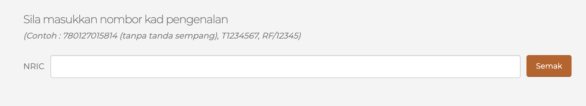
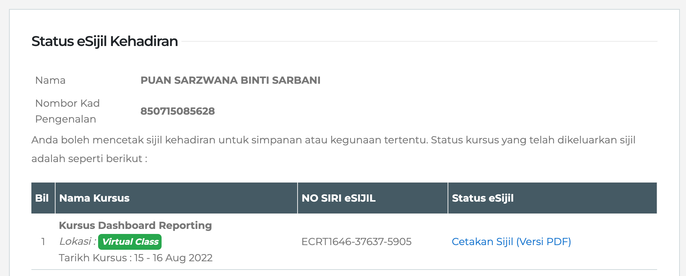

# Bagaimana untuk mendapatkan sijil anda?

Layari laman web akademi 
    https://academy.jpj.gov.my

Klik pada menu Sijil Kursus

Bagi mendapatkan sijil, anda perlu memasukkan No Kad Pengenalan dan klik butang Semak

Status eSijil Kehadiran dipaparkan dan klik pada cetakan sijil bagi kursus yang dihadiri.

Klik pada link Cetakan sijil (versi pdf) untuk dicetak. Sijil kursus ini akan berada di dalam sistem dan tidak mempunyai tarikh luput. Sijil ini dicetak jika perlu sahaja.

